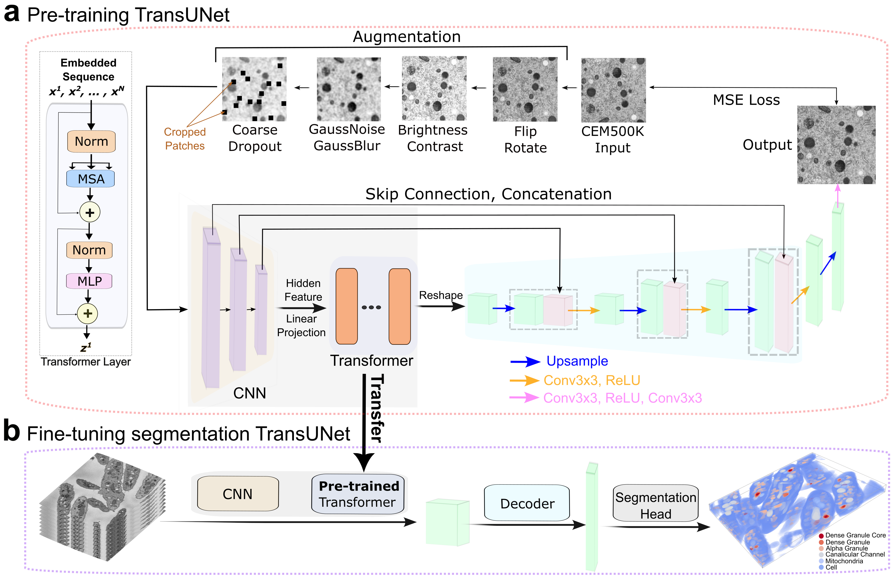

# RETINA
This is the official repository for RETINA: Reconstruction-based Pre-Trained Enhanced TransUNet for Electron Microscopy Segmentation on the CEM500K Dataset.

# Introduction
To improve subcellular structure segmentation for the EM community, we have designed RETINA that combines the advantages of pre-training on large EM-relevant datasets, CEM500K, with a hybrid model architecture incorporating both CNN and Transformer layers within the encoder. Given the unlabeled nature of the dataset, we established a reconstruction-based architecture for pre-training. By benchmarking on different datasets and models, it was found that RETINA significantly outperformed the randomly-initialized and MoCoV2 pre-trained models.



## Installation
1. **Python Environment**  
   Ensure you're using Python 3.10.

2. **Install PyTorch**  
   Install [PyTorch 2.0.1](https://pytorch.org/get-started/locally/) by following the instructions specific to your system and preferences (e.g., CUDA support).

3. **Clone the Repository**  
   Run the following command to clone the RETINA repository:
   ```bash
   git clone https://github.com/BaderLab/RETINA
   
4. **Enter the RETINA folder and install dependencies**  
   Navigate to the RETINA folder:
   ```bash
   cd RETINA
   pip install -r requirements.txt

## Get Started
Download the [model checkpoint](https://drive.google.com/drive/folders/1xOnqoskNMOwlFFNTR5ZiDDtukeEDWvrK?usp=drive_link)

We provide a way to quickly test the model on some images:

We offer a step-by-step tutorial in Jupyter-notebook.

You can run it locally with 'tutorial_quickstart.ipynb' in the Tutorial_quichstart directory.

## Model Training

### Data

Download the preprocessed [benchmark datasets](https://drive.google.com/drive/folders/1b5TkyaIkI94lk2OyJethxAaVWdZxwmmp?usp=drive_link)

Note: The preprocessing step was referenced from the one published with CEM500K dataset (Conrad, R. and Narayan, K. (2021)). If you would like to preprocess the benchmark datasets yourself, the code can be found in the CEM500K project.
For the convenience, we have uploaded the preprocessed five datasets used in RETINA project on the google drive. Also, the datasets have been splited already into train and test directories. 

### Pre-training

The model was pre-trained on CEM500K dataset with almost 500,000 images. It was pre-trained on Nvidia A100 GPU on the Compute Canada Narval cluster. The distribution was applied to accommodate 4 nodes, and each node has 4 GPUs. After downloading the [CEM500K dataset](https://www.ebi.ac.uk/empiar/EMPIAR-10592/), one can submit the pre-train job by using the slurm script

```bash
sbatch pretrain.slurm
```
Alternatively, one can directly run the python script for pretraining but need to ensure the required packages and the environment are set up correctly, which can be referred from the .slurm file. 
```bash
python pretrain.py
```
When pre-training process is done, we will get the pre-trained parameters that can be transferred to fine-tuning part.
For the convenience, we have uploaded the [pre-trained model](https://drive.google.com/drive/folders/1ijdk5pLYnqEK4YhGTogS4wrEvRqkZKX-?usp=drive_link) on google drive. 

In addition, for comparison, we have the benchmark models that were pre-trained on different datasets and the pre-trained models can also be found on the [google drive](https://drive.google.com/drive/folders/1xOnqoskNMOwlFFNTR5ZiDDtukeEDWvrK?usp=drive_link).

### Fine-tuning

If you found the pre-training process is too time or computational resource consuming, you might want to directly download the pre-trained model mentioned above and then start the fine-tuning part. Or you might want to further pre-train the model based on our submitted pre-trained model in order to gain better performance.

Before running fine-tuning, we need to ensure the right directory of the pre-trained model that is written in .yaml file in your finetine data directory. And we submitted an example .slurm file to submit the job of finetuning, therefore, one can simply submit the job by using the slurm script

```bash
sbatch run.slurm
```
Alternatively, one can directly run the python script for finetuning but need to ensure the required packages and the environment are set up correctly, which can be referred from above or from the slurm file. 
```bash
python train.py --config 'your config'
```
If you have got your own dataset for fine-tuning, simply change the directory in .yaml file. An example of .yaml is offered in the inference folder and can be customized based on your own dataset easily.

### Inference

After fine-tuning, RETINA can infer on the test images. For each benchmark directory, we offered two different types of inference, including 2D and 3D inference, placed in the inference folder.

```bash
python inference3d.py
```
OR
```bash
python inference2d.py
```

## Acknowledgements
- We thank the [CEM500K project](https://github.com/volume-em/cem-dataset?tab=readme-ov-file) for making the useful dataset.
- We also thank the [TransUNet](https://github.com/Beckschen/TransUNet) research on which we took reference.


If you find RETINA useful for your research and applications, please cite using this BibTeX:
```
@article{xing2025retina,
  title={RETINA: Reconstruction-based pre-trained enhanced TransUNet for electron microscopy segmentation on the CEM500K dataset},
  author={Xing, Cheng and Xie, Ronald and Bader, Gary D},
  journal={PLOS Computational Biology},
  volume={21},
  number={5},
  pages={e1013115},
  year={2025},
  publisher={Public Library of Science San Francisco, CA USA}
}
```
